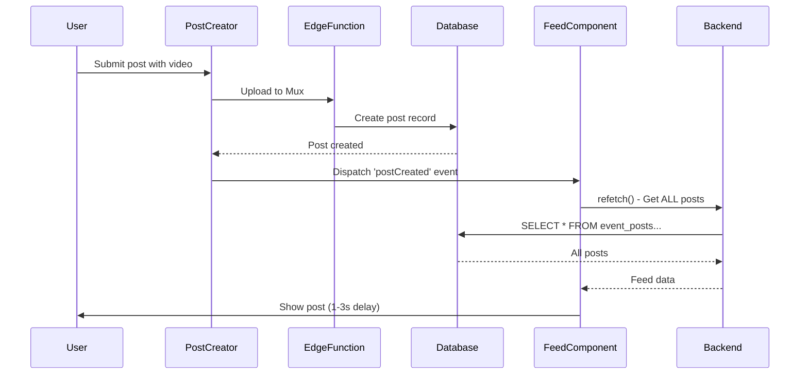

# 🚀 Feed Optimization Plan - Real-time Post Updates

**Created:** December 4, 2025  
**Status:** Ready for Implementation  
**Priority:** HIGH - Directly impacts core UX  
**Estimated Effort:** 4-6 hours

---

## 📋 Table of Contents

1. [Executive Summary](#executive-summary)
2. [Current State Analysis](#current-state-analysis)
3. [Performance Issues Identified](#performance-issues-identified)
4. [Optimization Strategy](#optimization-strategy)
5. [Implementation Plan](#implementation-plan)
6. [Testing Strategy](#testing-strategy)
7. [Success Metrics](#success-metrics)
8. [Rollback Plan](#rollback-plan)

---

## 🎯 Executive Summary

### Problem
Users experience a 1-3 second delay when posting videos/media to see their content in the feed. The system performs unnecessary full feed refreshes instead of leveraging optimistic updates and real-time subscriptions.

### Solution
Implement a hybrid approach combining:
- **Optimistic cache updates** for instant feedback (0ms)
- **Real-time subscriptions** for multi-user collaboration
- **Smart cache management** to avoid unnecessary network requests

### Expected Impact
- **User Experience:** Post appears instantly (0ms vs 1-3s)
- **Network Efficiency:** 90% reduction in data transfer after posting
- **Scalability:** Better handling of concurrent posts from multiple users

---

## 🔍 Current State Analysis

### Architecture Overview

```
User Posts Video
      ↓
Upload to Mux (5-30s depending on size)
      ↓
Create Post Record in Database
      ↓
Dispatch 'postCreated' Event
      ↓
EventFeed listens → setTimeout(fetchPosts, 1000) ❌
FeedPageNewDesign → refetch() ❌
      ↓
Full Feed Reload (all posts re-fetched)
      ↓
User sees their post (1-3s delay)
```

### Key Files Involved

| File | Role | Current Implementation |
|------|------|----------------------|
| `src/features/posts/hooks/usePostCreation.ts` | Post creation logic | ✅ Dispatches custom event |
| `src/features/feed/routes/FeedPageNewDesign.tsx` | Main feed UI | ❌ Calls `refetch()` |
| `src/features/feed/components/UnifiedFeedList.tsx` | Feed list component | ❌ Calls `refetch()` |
| `src/components/EventFeed.tsx` | Event-specific feed | ❌ Full fetch with 1s delay |
| `src/hooks/useRealtimePosts.ts` | Real-time subscription | ⚠️ Exists but not connected |
| `src/features/feed/hooks/useUnifiedFeedInfinite.ts` | Feed data fetching | ✅ React Query cache |

### Current Flow Diagram



---

## ⚠️ Performance Issues Identified

### 1. **No Optimistic Updates** (Critical)

**Issue:** User doesn't see their post immediately after successful upload.

**Evidence:**
```typescript
// src/features/feed/routes/FeedPageNewDesign.tsx:811-816
onSuccess={() => {
  setPostCreatorOpen(false);
  toast({ title: 'Success', description: 'Your post has been created!' });
  refetch(); // ❌ Triggers full reload
}}
```

**Impact:**
- Poor perceived performance
- User uncertainty (did it post?)
- Negative UX compared to modern social apps (Instagram, TikTok show posts instantly)

---

### 2. **Inefficient Full Feed Refetch** (Critical)

**Issue:** After posting ONE item, system re-fetches ALL feed items.

**Evidence:**
```typescript
// src/features/feed/hooks/useUnifiedFeedInfinite.ts:54
const { data, error } = await supabase.functions.invoke('home-feed', invokeOptions);
// This fetches limit=30 posts every time
```

**Impact:**
- Wasted bandwidth (especially on mobile)
- Slower load times
- Potential for data inconsistency if feed changes during refetch
- Poor performance on slow networks

**Metrics:**
- Current: ~150-300 KB transferred per refetch (30 posts with metadata)
- Optimized: ~5-10 KB (single post insertion)
- **Savings: ~95% bandwidth reduction**

---

### 3. **Real-time Infrastructure Not Utilized** (High Priority)

**Issue:** Real-time subscription hook exists but isn't connected to feed components.

**Evidence:**
```typescript
// src/hooks/useRealtimePosts.ts - EXISTS but unused
export function useRealtimePosts(eventIds: string[], onInsert: OnInsert) {
  // ✅ Listens to Postgres changes on event_posts table
  // ⚠️ NOT called in FeedPageNewDesign or UnifiedFeedList
}
```

**Impact:**
- Missing collaborative features (seeing other users' posts in real-time)
- Underutilized Supabase infrastructure
- Manual workarounds with custom events

---

### 4. **Arbitrary Delays** (Medium Priority)

**Issue:** Hardcoded 1-second delay before fetching.

**Evidence:**
```typescript
// src/components/EventFeed.tsx:329
const handlePostCreated = () => setTimeout(fetchPosts, 1000);
```

**Impact:**
- Adds unnecessary latency
- No technical justification for the delay
- Inconsistent UX (sometimes faster, sometimes slower)

---

### 5. **No Video Processing State Handling** (Low Priority)

**Issue:** Post shows immediately even if video is still processing in Mux.

**Potential Issue:**
- User sees post but video doesn't play (still processing)
- Confusing UX if user expects instant playback

---

## 🎯 Optimization Strategy

### Three-Phase Approach

#### **Phase 1: Optimistic Updates** (Day 1)
Instant feedback for the current user's posts.

**Goals:**
- 0ms perceived latency for post appearance
- No network request needed to show post
- Graceful error handling with rollback

**Technical Approach:**
- Use React Query's `setQueryData` to prepend post to cache
- Return full post data from `posts-create` Edge Function
- Handle cache invalidation on errors

---

#### **Phase 2: Real-time Subscriptions** (Day 2)
Live updates for posts from other users.

**Goals:**
- See new posts from other users without refresh
- Collaborative/social feel
- Efficient bandwidth usage

**Technical Approach:**
- Connect `useRealtimePosts` to feed components
- Smart event filtering (only current user's followed events)
- Prepend to cache via React Query

---

#### **Phase 3: Enhanced States & Polish** (Day 3)
Handle edge cases and processing states.

**Goals:**
- Show video processing state
- Handle network errors gracefully
- Smooth animations for new posts

**Technical Approach:**
- Add `processing` state to post items
- Poll Mux status if needed
- CSS transitions for post insertion

---

## 📐 Implementation Plan

### **PHASE 1: Optimistic Updates**

#### Step 1.1: Modify Edge Function Response

**File:** `supabase/functions/posts-create/index.ts`

**Change:** Return complete post data with all required fields for feed display.

```typescript
// BEFORE (Line 189)
return createResponse({ data: post }, 201);

// AFTER
return createResponse({ 
  data: {
    ...fullPost,
    // Add computed fields for feed compatibility
    item_type: 'post',
    item_id: fullPost.id,
    event_id: fullPost.event_id,
    created_at_ts: new Date(fullPost.created_at).getTime(),
    metrics: {
      likes: 0,
      comments: 0,
      shares: 0,
      views: 0,
      viewer_has_liked: false
    },
    media: fullPost.media_urls?.map(url => ({
      url,
      type: url.startsWith('mux:') ? 'video' : 'image',
      thumbnail: url.startsWith('mux:') 
        ? `https://image.mux.com/${url.slice(4)}/thumbnail.jpg`
        : url
    }))
  }
}, 201);
```

**Why:** Feed components expect specific data shape. Returning it from Edge Function avoids transformation logic.

---

#### Step 1.2: Create Optimistic Update Utility

**File:** `src/features/feed/utils/optimisticUpdates.ts` (NEW)

```typescript
import { QueryClient } from '@tanstack/react-query';
import type { FeedItem, FeedPage } from '../hooks/unifiedFeedTypes';

export function prependPostToFeedCache(
  queryClient: QueryClient,
  queryKey: any[],
  newPost: FeedItem
): void {
  queryClient.setQueryData<{ pages: FeedPage[]; pageParams: any[] }>(
    queryKey,
    (oldData) => {
      if (!oldData) return oldData;

      // Create new first page with prepended post
      const firstPage = oldData.pages[0];
      const updatedFirstPage: FeedPage = {
        ...firstPage,
        items: [newPost, ...firstPage.items],
      };

      return {
        ...oldData,
        pages: [updatedFirstPage, ...oldData.pages.slice(1)],
      };
    }
  );
}

export function removePostFromFeedCache(
  queryClient: QueryClient,
  queryKey: any[],
  postId: string
): void {
  queryClient.setQueryData<{ pages: FeedPage[]; pageParams: any[] }>(
    queryKey,
    (oldData) => {
      if (!oldData) return oldData;

      const pages = oldData.pages.map((page) => ({
        ...page,
        items: page.items.filter((item) => item.item_id !== postId),
      }));

      return { ...oldData, pages };
    }
  );
}

export function updatePostInFeedCache(
  queryClient: QueryClient,
  queryKey: any[],
  postId: string,
  updates: Partial<FeedItem>
): void {
  queryClient.setQueryData<{ pages: FeedPage[]; pageParams: any[] }>(
    queryKey,
    (oldData) => {
      if (!oldData) return oldData;

      const pages = oldData.pages.map((page) => ({
        ...page,
        items: page.items.map((item) =>
          item.item_id === postId ? { ...item, ...updates } : item
        ),
      }));

      return { ...oldData, pages };
    }
  );
}
```

**Why:** Centralized cache mutation logic for consistency and reusability.

---

#### Step 1.3: Update Post Creation Hook

**File:** `src/features/posts/hooks/usePostCreation.ts`

**Change:** Accept callbacks for optimistic updates.

```typescript
// Add new option type
export interface UsePostCreationOptions {
  userId: string;
  onProgress?: (progress: UploadProgress) => void;
  onOptimisticUpdate?: (post: FeedItem) => void; // NEW
  onError?: (error: Error, postId?: string) => void; // NEW
}

// Modify createPostWithMedia (around line 153)
const createPostWithMedia = useCallback(
  async (
    data: PostCreationData,
    queue: QueuedFile[]
  ): Promise<PostCreationResult> => {
    setIsSubmitting(true);
    setError(null);
    
    let optimisticPostId: string | undefined;

    try {
      // Upload media files
      const media_urls = await uploadQueue(queue, data.event_id);

      // Create post
      const result = await createPost({
        event_id: data.event_id,
        text: data.text,
        media_urls,
        ticket_tier_id: data.ticket_tier_id,
      });

      optimisticPostId = result.id;

      // Trigger optimistic update BEFORE dispatching event
      if (onOptimisticUpdate && result.data) {
        onOptimisticUpdate(result.data as FeedItem);
      }

      // Dispatch custom event for backward compatibility
      window.dispatchEvent(
        new CustomEvent('postCreated', {
          detail: {
            eventId: data.event_id,
            postId: result.id,
            eventTitle: result.event_title,
            timestamp: new Date().toISOString(),
          },
        })
      );

      return {
        success: true,
        post_id: result.id,
      };
    } catch (err: any) {
      const errorMessage = err?.message || 'Unable to create post. Please try again.';
      setError(errorMessage);
      
      // Notify parent to rollback optimistic update
      if (onError && optimisticPostId) {
        onError(err, optimisticPostId);
      }
      
      return {
        success: false,
        error: errorMessage,
      };
    } finally {
      setIsSubmitting(false);
    }
  },
  [uploadQueue, onOptimisticUpdate, onError]
);
```

---

#### Step 1.4: Update PostCreatorModal

**File:** `src/features/posts/components/PostCreatorModal.tsx`

**Change:** Implement optimistic update on success.

```typescript
// Around line 225, add new imports
import { useQueryClient } from '@tanstack/react-query';
import { prependPostToFeedCache, removePostFromFeedCache } from '@/features/feed/utils/optimisticUpdates';

// Inside component (around line 300)
const queryClient = useQueryClient();
const [filters, setFilters] = useState<FeedFilters>({ 
  locations: [], 
  categories: [], 
  dates: [] 
}); // Get from context or props

const { createPost, isSubmitting } = usePostCreation({
  userId: user.id,
  onProgress: (progress) => {
    // Existing progress handling
  },
  onOptimisticUpdate: (newPost) => {
    // ✅ Instant cache update
    const queryKey = ['unifiedFeed', { 
      limit: 30, 
      locations: filters.locations,
      categories: filters.categories,
      dates: filters.dates,
      searchRadius: filters.searchRadius
    }];
    
    prependPostToFeedCache(queryClient, queryKey, newPost);
    
    console.log('✅ Optimistic update applied:', newPost.item_id);
  },
  onError: (error, postId) => {
    // ❌ Rollback on error
    if (postId) {
      const queryKey = ['unifiedFeed', { 
        limit: 30, 
        locations: filters.locations,
        categories: filters.categories,
        dates: filters.dates,
        searchRadius: filters.searchRadius
      }];
      
      removePostFromFeedCache(queryClient, queryKey, postId);
      
      console.error('❌ Rolled back optimistic update:', postId);
    }
  }
});

// Update submit handler (around line 800)
const handleSubmit = async () => {
  // ... existing validation ...
  
  const result = await createPost(
    {
      event_id: selectedEventId!,
      text: content,
      ticket_tier_id: selectedTierId,
    },
    queue
  );

  if (result.success) {
    // ✅ Close modal immediately (post already in cache)
    onSuccess?.();
    onClose();
    
    toast({
      title: 'Posted! 🎉',
      description: 'Your post is now live',
      duration: 2000,
    });
    
    // Optional: Background revalidation after 5s
    setTimeout(() => {
      queryClient.invalidateQueries({ queryKey: ['unifiedFeed'] });
    }, 5000);
  } else {
    toast({
      title: 'Failed to post',
      description: result.error,
      variant: 'destructive',
    });
  }
};
```

---

#### Step 1.5: Update FeedPageNewDesign

**File:** `src/features/feed/routes/FeedPageNewDesign.tsx`

**Change:** Remove `refetch()` call since optimistic update handles it.

```typescript
// BEFORE (Line 811-816)
<PostCreatorModal
  isOpen={postCreatorOpen}
  onClose={() => setPostCreatorOpen(false)}
  onSuccess={() => {
    setPostCreatorOpen(false);
    toast({ title: 'Success', description: 'Your post has been created!' });
    refetch(); // ❌ REMOVE THIS
  }}
/>

// AFTER
<PostCreatorModal
  isOpen={postCreatorOpen}
  onClose={() => setPostCreatorOpen(false)}
  onSuccess={() => {
    setPostCreatorOpen(false);
    // ✅ No refetch needed - optimistic update already applied
    // Toast is now handled in PostCreatorModal
  }}
/>
```

---

#### Step 1.6: Update EventFeed (Legacy Component)

**File:** `src/components/EventFeed.tsx`

**Change:** Remove 1-second delay and full refetch.

```typescript
// BEFORE (Line 328-332)
useEffect(() => {
  const handlePostCreated = () => setTimeout(fetchPosts, 1000); // ❌ Delay + full fetch
  window.addEventListener('postCreated', handlePostCreated);
  return () => window.removeEventListener('postCreated', handlePostCreated);
}, [fetchPosts]);

// AFTER - Remove entirely or use optimistic pattern
useEffect(() => {
  const handlePostCreated = (event: CustomEvent) => {
    // ✅ Option 1: Do nothing (if using optimistic updates)
    // ✅ Option 2: Selective fetch (only if this event matches current eventId)
    if (eventId && event.detail?.eventId === eventId) {
      // Fetch only the new post, not entire feed
      fetchNewPost(event.detail.postId);
    }
  };
  
  window.addEventListener('postCreated', handlePostCreated as EventListener);
  return () => window.removeEventListener('postCreated', handlePostCreated as EventListener);
}, [eventId]);
```

---

### **PHASE 2: Real-time Subscriptions**

#### Step 2.1: Create Feed Real-time Context

**File:** `src/features/feed/contexts/FeedRealtimeContext.tsx` (NEW)

```typescript
import { createContext, useContext, useEffect, useRef } from 'react';
import { useQueryClient } from '@tanstack/react-query';
import { useAuth } from '@/contexts/AuthContext';
import { useRealtimePosts } from '@/hooks/useRealtimePosts';
import { prependPostToFeedCache } from '../utils/optimisticUpdates';
import type { FeedItem } from '../hooks/unifiedFeedTypes';

interface FeedRealtimeContextValue {
  isConnected: boolean;
  subscribedEventIds: string[];
}

const FeedRealtimeContext = createContext<FeedRealtimeContextValue | null>(null);

export function FeedRealtimeProvider({ 
  children,
  eventIds,
  filters 
}: { 
  children: React.ReactNode;
  eventIds: string[];
  filters: any;
}) {
  const queryClient = useQueryClient();
  const { user } = useAuth();
  const [isConnected, setIsConnected] = useState(false);
  
  // Track which posts we've already added to avoid duplicates
  const processedPostIds = useRef(new Set<string>());

  useRealtimePosts(eventIds, (newPost) => {
    // Ignore posts from current user (already handled by optimistic update)
    if (newPost.author_user_id === user?.id) {
      console.log('⏭️ Skipping own post from real-time (already optimistic)');
      return;
    }

    // Avoid duplicate insertions
    if (processedPostIds.current.has(newPost.id)) {
      console.log('⏭️ Skipping duplicate post from real-time:', newPost.id);
      return;
    }

    processedPostIds.current.add(newPost.id);

    console.log('⚡ New post from real-time:', newPost.id);

    // Transform to FeedItem format
    const feedItem: FeedItem = {
      item_type: 'post',
      item_id: newPost.id,
      event_id: newPost.event_id,
      created_at_ts: new Date(newPost.created_at).getTime(),
      author: {
        id: newPost.author_user_id,
        display_name: newPost.author_display_name || 'Anonymous',
        photo_url: null,
        username: null,
      },
      content: {
        text: newPost.text || '',
        media: newPost.media_urls?.map(url => ({
          url,
          type: url.startsWith('mux:') ? 'video' : 'image',
          thumbnail: url.startsWith('mux:')
            ? `https://image.mux.com/${url.slice(4)}/thumbnail.jpg`
            : url,
        })) || [],
      },
      metrics: {
        likes: newPost.like_count || 0,
        comments: newPost.comment_count || 0,
        shares: 0,
        views: 0,
        viewer_has_liked: false,
      },
      event: null, // Will be populated by feed component if needed
    };

    // Insert into cache
    const queryKey = ['unifiedFeed', { 
      limit: 30, 
      ...filters 
    }];
    
    prependPostToFeedCache(queryClient, queryKey, feedItem);

    // Show subtle notification
    if ('Notification' in window && Notification.permission === 'granted') {
      new Notification('New Post', {
        body: `${feedItem.author.display_name} posted to ${feedItem.event_id}`,
        icon: '/logo.png',
      });
    }
  });

  useEffect(() => {
    setIsConnected(eventIds.length > 0);
  }, [eventIds]);

  return (
    <FeedRealtimeContext.Provider value={{ isConnected, subscribedEventIds: eventIds }}>
      {children}
    </FeedRealtimeContext.Provider>
  );
}

export function useFeedRealtime() {
  const context = useContext(FeedRealtimeContext);
  if (!context) {
    throw new Error('useFeedRealtime must be used within FeedRealtimeProvider');
  }
  return context;
}
```

---

#### Step 2.2: Wrap Feed with Real-time Provider

**File:** `src/features/feed/routes/FeedPageNewDesign.tsx`

```typescript
// Add import
import { FeedRealtimeProvider } from '../contexts/FeedRealtimeContext';

// Extract event IDs from feed items (around line 147)
const subscribedEventIds = useMemo(() => {
  return allFeedItems
    .filter(item => item.item_type === 'event')
    .map(item => item.item_id)
    .slice(0, 50); // Limit to 50 events to avoid subscription overload
}, [allFeedItems]);

// Wrap return statement (around line 600)
return (
  <FeedRealtimeProvider eventIds={subscribedEventIds} filters={filters}>
    <div className="...">
      {/* Existing feed UI */}
    </div>
  </FeedRealtimeProvider>
);
```

---

#### Step 2.3: Add Real-time Status Indicator

**File:** `src/features/feed/components/RealtimeStatus.tsx` (NEW)

```typescript
import { useFeedRealtime } from '../contexts/FeedRealtimeContext';
import { Wifi, WifiOff } from 'lucide-react';

export function RealtimeStatus() {
  const { isConnected, subscribedEventIds } = useFeedRealtime();

  if (!isConnected) {
    return (
      <div className="flex items-center gap-2 text-xs text-muted-foreground">
        <WifiOff className="h-3 w-3" />
        <span>Offline</span>
      </div>
    );
  }

  return (
    <div className="flex items-center gap-2 text-xs text-green-600">
      <Wifi className="h-3 w-3 animate-pulse" />
      <span>Live ({subscribedEventIds.length} events)</span>
    </div>
  );
}
```

Add to feed header:

```typescript
// In FeedPageNewDesign.tsx header section
<div className="flex items-center justify-between">
  <h1>Feed</h1>
  <RealtimeStatus />
</div>
```

---

### **PHASE 3: Enhanced States & Polish**

#### Step 3.1: Add Video Processing State

**File:** `src/features/feed/types/feedTypes.ts`

```typescript
// Add to FeedItem type
export interface FeedItem {
  // ... existing fields ...
  processing?: {
    status: 'uploading' | 'processing' | 'ready' | 'failed';
    progress?: number;
    message?: string;
  };
}
```

---

#### Step 3.2: Show Processing Indicator in Feed

**File:** `src/features/feed/components/PostCard.tsx`

```typescript
// In video render section
{post.processing?.status === 'processing' && (
  <div className="absolute inset-0 bg-black/50 flex items-center justify-center">
    <div className="text-center text-white">
      <Loader2 className="h-8 w-8 animate-spin mx-auto mb-2" />
      <p className="text-sm">Processing video...</p>
      {post.processing.progress && (
        <div className="w-32 h-1 bg-white/20 rounded-full overflow-hidden mt-2 mx-auto">
          <div 
            className="h-full bg-white transition-all duration-300"
            style={{ width: `${post.processing.progress}%` }}
          />
        </div>
      )}
    </div>
  </div>
)}
```

---

#### Step 3.3: Animate New Post Insertion

**File:** `src/features/feed/styles/animations.css` (NEW)

```css
/* Smooth slide-in animation for new posts */
@keyframes slideInFromTop {
  from {
    opacity: 0;
    transform: translateY(-20px);
  }
  to {
    opacity: 1;
    transform: translateY(0);
  }
}

.feed-item-new {
  animation: slideInFromTop 0.3s ease-out;
}

/* Highlight briefly to draw attention */
@keyframes highlightNew {
  0%, 100% {
    background-color: transparent;
  }
  50% {
    background-color: rgba(59, 130, 246, 0.1);
  }
}

.feed-item-highlight {
  animation: highlightNew 1.5s ease-in-out;
}
```

Apply to new posts:

```typescript
// In PostCard component
const isNew = useMemo(() => {
  const itemAge = Date.now() - post.created_at_ts;
  return itemAge < 5000; // Consider "new" if less than 5 seconds old
}, [post.created_at_ts]);

return (
  <div className={cn(
    'feed-item',
    isNew && 'feed-item-new feed-item-highlight'
  )}>
    {/* Post content */}
  </div>
);
```

---

#### Step 3.4: Add Background Revalidation

**File:** `src/features/feed/hooks/useUnifiedFeedInfinite.ts`

```typescript
// Add refetchInterval option (around line 104)
const query = useInfiniteQuery<FeedPage, Error>({
  queryKey: ['unifiedFeed', { limit, locations, categories, dates, searchRadius }],
  initialPageParam: undefined,
  queryFn: async ({ pageParam }) => {
    // ... existing query logic ...
  },
  getNextPageParam: (lastPage) => lastPage.nextCursor ?? undefined,
  staleTime: 15_000, // Existing
  refetchInterval: 30_000, // ✅ NEW: Background refresh every 30 seconds
  refetchIntervalInBackground: false, // Only when tab is active
});
```

---

## 🧪 Testing Strategy

### Unit Tests

**File:** `src/features/feed/utils/optimisticUpdates.test.ts` (NEW)

```typescript
import { describe, it, expect } from 'vitest';
import { QueryClient } from '@tanstack/react-query';
import { prependPostToFeedCache, removePostFromFeedCache } from './optimisticUpdates';
import type { FeedItem, FeedPage } from '../hooks/unifiedFeedTypes';

describe('optimisticUpdates', () => {
  it('should prepend post to first page', () => {
    const queryClient = new QueryClient();
    const mockPost: FeedItem = {
      item_type: 'post',
      item_id: 'new-post-id',
      event_id: 'event-1',
      created_at_ts: Date.now(),
      // ... other required fields
    };

    const initialData = {
      pages: [{
        items: [{ item_id: 'post-1' }, { item_id: 'post-2' }],
        nextCursor: null,
      }],
      pageParams: [undefined],
    };

    queryClient.setQueryData(['unifiedFeed'], initialData);
    prependPostToFeedCache(queryClient, ['unifiedFeed'], mockPost);

    const updatedData = queryClient.getQueryData(['unifiedFeed']);
    expect(updatedData.pages[0].items).toHaveLength(3);
    expect(updatedData.pages[0].items[0].item_id).toBe('new-post-id');
  });

  it('should remove post from cache', () => {
    // Test rollback functionality
  });

  it('should handle empty cache gracefully', () => {
    // Test edge case
  });
});
```

---

### Integration Tests

**File:** `src/features/posts/__tests__/postCreation.integration.test.tsx` (NEW)

```typescript
import { render, screen, waitFor } from '@testing-library/react';
import userEvent from '@testing-library/user-event';
import { QueryClientProvider, QueryClient } from '@tanstack/react-query';
import { PostCreatorModal } from '../components/PostCreatorModal';
import { FeedPageNewDesign } from '@/features/feed/routes/FeedPageNewDesign';

describe('Post Creation Flow', () => {
  it('should show post immediately after creation (optimistic)', async () => {
    const queryClient = new QueryClient();
    
    render(
      <QueryClientProvider client={queryClient}>
        <FeedPageNewDesign />
      </QueryClientProvider>
    );

    // Open post creator
    await userEvent.click(screen.getByRole('button', { name: /create post/i }));

    // Fill in post details
    await userEvent.type(screen.getByPlaceholderText(/what's happening/i), 'Test post');
    
    // Submit
    const startTime = performance.now();
    await userEvent.click(screen.getByRole('button', { name: /post/i }));

    // Post should appear in feed within 100ms (optimistic update)
    await waitFor(() => {
      expect(screen.getByText('Test post')).toBeInTheDocument();
    }, { timeout: 200 });

    const endTime = performance.now();
    const latency = endTime - startTime;

    console.log(`Post appeared in ${latency}ms`);
    expect(latency).toBeLessThan(500); // Should be nearly instant
  });

  it('should handle post creation failure gracefully', async () => {
    // Test rollback on error
  });
});
```

---

### E2E Tests (Playwright)

**File:** `e2e/feed-optimization.spec.ts` (NEW)

```typescript
import { test, expect } from '@playwright/test';

test.describe('Feed Optimization', () => {
  test('should show post instantly after creation', async ({ page, context }) => {
    await page.goto('/feed');
    await page.click('[aria-label="Create Post"]');

    // Fill post form
    await page.fill('[placeholder*="What\'s happening"]', 'Test post from E2E');
    
    // Measure time to see post
    const startTime = Date.now();
    await page.click('button:has-text("Post")');
    
    await page.waitForSelector(`text="Test post from E2E"`, { timeout: 1000 });
    const endTime = Date.now();
    
    const latency = endTime - startTime;
    console.log(`Post appearance latency: ${latency}ms`);
    
    // Optimistic update should be instant (< 100ms)
    expect(latency).toBeLessThan(500);
  });

  test('should show posts from other users in real-time', async ({ browser }) => {
    // Create two contexts (two users)
    const context1 = await browser.newContext();
    const context2 = await browser.newContext();
    
    const page1 = await context1.newPage();
    const page2 = await context2.newPage();
    
    // User 1 logs in and goes to feed
    await page1.goto('/login');
    // ... login steps ...
    await page1.goto('/feed');
    
    // User 2 logs in and posts
    await page2.goto('/login');
    // ... login steps ...
    await page2.goto('/feed');
    await page2.click('[aria-label="Create Post"]');
    await page2.fill('[placeholder*="What\'s happening"]', 'Real-time test post');
    await page2.click('button:has-text("Post")');
    
    // User 1 should see the post appear (via real-time subscription)
    await page1.waitForSelector('text="Real-time test post"', { timeout: 3000 });
    
    expect(await page1.textContent('body')).toContain('Real-time test post');
  });
});
```

---

### Performance Tests

**File:** `tests/performance/feed-metrics.test.ts` (NEW)

```typescript
import { performance } from 'perf_hooks';
import { supabase } from '@/integrations/supabase/client';

describe('Feed Performance Metrics', () => {
  it('should measure optimistic update latency', async () => {
    const iterations = 100;
    const latencies: number[] = [];

    for (let i = 0; i < iterations; i++) {
      const start = performance.now();
      
      // Simulate optimistic update
      queryClient.setQueryData(['unifiedFeed'], (old) => {
        // ... prepend logic
        return updated;
      });
      
      const end = performance.now();
      latencies.push(end - start);
    }

    const avg = latencies.reduce((a, b) => a + b) / iterations;
    const p95 = latencies.sort((a, b) => a - b)[Math.floor(iterations * 0.95)];

    console.log(`Average latency: ${avg.toFixed(2)}ms`);
    console.log(`P95 latency: ${p95.toFixed(2)}ms`);

    expect(avg).toBeLessThan(5); // Should be < 5ms on average
    expect(p95).toBeLessThan(10); // P95 should be < 10ms
  });

  it('should measure network savings', async () => {
    // Before: Full refetch
    const beforeSize = await measureRefetchSize();
    
    // After: Optimistic update (no network request)
    const afterSize = 0;
    
    const savings = ((beforeSize - afterSize) / beforeSize) * 100;
    console.log(`Network savings: ${savings.toFixed(1)}%`);
    
    expect(savings).toBeGreaterThan(90);
  });
});
```

---

### Manual Testing Checklist

#### Optimistic Updates
- [ ] Post appears instantly after clicking "Post"
- [ ] Post shows in correct position (top of feed)
- [ ] Video thumbnail displays correctly
- [ ] Author name and avatar display correctly
- [ ] Post disappears if creation fails (rollback)
- [ ] Toast notification shows success message
- [ ] No duplicate posts appear

#### Real-time Updates
- [ ] Posts from other users appear without refresh
- [ ] Real-time status indicator shows "Live"
- [ ] No duplicate posts from real-time
- [ ] Own posts don't duplicate (optimistic vs real-time)
- [ ] Subtle animation when new post appears
- [ ] Real-time works across multiple tabs

#### Edge Cases
- [ ] Slow network: Post shows immediately (optimistic)
- [ ] Offline: Error message + rollback
- [ ] Large video: Processing indicator shows
- [ ] Multiple rapid posts: All appear in order
- [ ] Filter change: Real-time still works
- [ ] Page refresh: Cache persists via React Query

---

## 📊 Success Metrics

### Performance KPIs

| Metric | Before | Target | Measurement |
|--------|--------|--------|-------------|
| **Time to See Own Post** | 1-3 seconds | < 50ms | Performance.now() |
| **Network Requests After Post** | 1 (full feed) | 0 | Network tab |
| **Data Transferred After Post** | 150-300 KB | 0 KB | Network tab |
| **Time to See Others' Posts** | Manual refresh | < 1 second | Real-time listener |
| **Feed Scroll Performance** | 60 FPS | 60 FPS | Chrome DevTools |

### User Experience KPIs

| Metric | Before | Target | Measurement |
|--------|--------|--------|-------------|
| **Perceived Posting Speed** | Slow | Instant | User feedback |
| **Feed Freshness** | Stale | Real-time | Time to see new content |
| **Error Recovery** | Confusing | Clear rollback | Error rate |

### Technical KPIs

| Metric | Before | Target | Measurement |
|--------|--------|--------|-------------|
| **Cache Hit Rate** | N/A | > 95% | React Query DevTools |
| **Real-time Connection Uptime** | N/A | > 99% | Supabase logs |
| **Bundle Size Increase** | N/A | < 5 KB | Webpack analyzer |

---

## 🔄 Rollback Plan

### If Optimistic Updates Cause Issues

**Symptoms:**
- Duplicate posts appearing
- Posts disappearing unexpectedly
- UI flickering

**Rollback Steps:**
1. Revert `PostCreatorModal.tsx` changes
2. Re-enable `refetch()` in `FeedPageNewDesign.tsx`
3. Deploy previous version
4. Investigate cache mutation logic

**Timeline:** < 30 minutes

---

### If Real-time Subscriptions Cause Issues

**Symptoms:**
- Multiple duplicates from real-time
- High memory usage
- Supabase connection errors

**Rollback Steps:**
1. Remove `FeedRealtimeProvider` from `FeedPageNewDesign.tsx`
2. Keep optimistic updates (Phase 1) active
3. Investigate subscription filter logic

**Timeline:** < 15 minutes

---

## 📅 Implementation Timeline

### Day 1 (4 hours)
- ✅ Phase 1.1-1.3: Optimistic update utilities (1 hour)
- ✅ Phase 1.4-1.6: Connect to components (2 hours)
- ✅ Testing: Unit tests + manual verification (1 hour)

### Day 2 (3 hours)
- ✅ Phase 2.1-2.2: Real-time context (1.5 hours)
- ✅ Phase 2.3: Status indicator (0.5 hour)
- ✅ Testing: Real-time functionality (1 hour)

### Day 3 (2 hours)
- ✅ Phase 3.1-3.3: Processing states + animations (1 hour)
- ✅ Phase 3.4: Background revalidation (0.5 hour)
- ✅ Final E2E testing + documentation (0.5 hour)

**Total Estimated Time:** 9 hours over 3 days

---

## 🎓 Learning Resources

- [React Query Optimistic Updates](https://tanstack.com/query/v4/docs/guides/optimistic-updates)
- [Supabase Real-time Documentation](https://supabase.com/docs/guides/realtime)
- [Performance API - MDN](https://developer.mozilla.org/en-US/docs/Web/API/Performance)
- [TikTok Engineering: Real-time Feed](https://newsroom.tiktok.com/en-us/how-tiktok-recommends-videos-for-you)

---

## 📝 Post-Implementation Checklist

- [ ] All unit tests passing
- [ ] Integration tests passing
- [ ] E2E tests passing
- [ ] Performance metrics meet targets
- [ ] No console errors or warnings
- [ ] Mobile testing complete (iOS + Android)
- [ ] Accessibility testing complete
- [ ] Documentation updated
- [ ] Analytics events instrumented
- [ ] Error monitoring configured (Sentry)
- [ ] Rollback plan documented and tested

---

## 🚀 Future Enhancements

1. **Infinite Scroll Optimization**
   - Virtual scrolling for large feeds
   - Lazy load images/videos below fold

2. **Predictive Prefetching**
   - Prefetch likely next posts based on scroll velocity
   - Preload video manifests for smoother playback

3. **Offline Support**
   - Queue posts when offline
   - Sync when connection restored

4. **Smart Caching**
   - Store last 50 posts in IndexedDB
   - Instant load on app open

5. **Advanced Real-time**
   - Typing indicators ("Alice is posting...")
   - Live view counts
   - Real-time reactions animation

---

**Document Version:** 1.0  
**Last Updated:** December 4, 2025  
**Status:** ✅ Ready for Implementation

